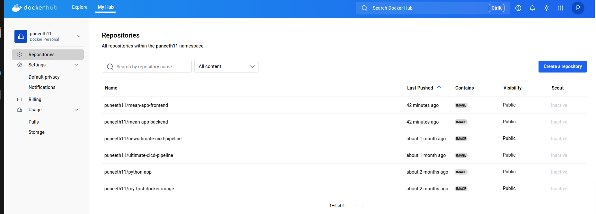
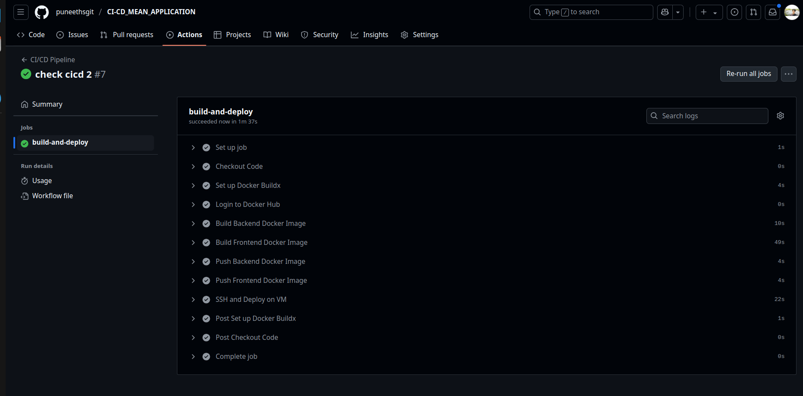

# DevOps Assignment - MEAN Stack Application Deployment

---

## 📌 Project Overview
This project demonstrates the containerization and deployment of a full-stack **MEAN (MongoDB, Express, Angular, Node.js)** CRUD application on an Ubuntu virtual machine. The application is reverse proxied using **Nginx** and is deployed using **Docker Compose**. It also includes a **CI/CD pipeline** built using **GitHub Actions** to ensure seamless deployment upon every push to the main branch.

---

## ✅ Objectives Completed

### 1. 📂 GitHub Repository Setup
- Created and structured a GitHub repository.
- Pushed the complete source code, including:
  - Angular frontend
  - Node.js/Express backend
  - Dockerfiles for each service
  - Docker Compose configuration
  - GitHub Actions workflow for CI/CD automation

### 2. 🚧 Docker Containerization
- Designed **multi-stage Dockerfiles** for frontend and backend to optimize image size and build time.
- Leveraged the official MongoDB image from Docker Hub.
- Ensured inter-container communication via Docker Compose network.

#### 🐳 Frontend Dockerfile
```dockerfile
# Multi Stage DOCKER

# Stage 1: Build Angular app
FROM node:18-alpine as build

WORKDIR /app

COPY package*.json ./
RUN npm install

COPY . .
RUN npm run build -- --configuration production --project angular-15-crud

# Stage 2: Serve Angular with Nginx
FROM nginx:alpine

COPY --from=build /app/dist/angular-15-crud /usr/share/nginx/html

EXPOSE 80

CMD ["nginx", "-g", "daemon off;"]
```

#### 🐳 Backend Dockerfile
```dockerfile
# Node.js image
FROM node:18-alpine

# Set working dir
WORKDIR /app

# Copy package files & install dependencies
COPY package*.json ./
RUN npm install

# Copy source code
COPY . .

# Expose the backend port
EXPOSE 8082

# Start the server
CMD ["node", "server.js"]
```

### 3. 🧱 Local Docker Compose Setup
```yaml
services:
  mongo:
    image: mongo
    restart: always
    container_name: mongo
    ports:
      - "27017:27017"
    volumes:
      - mongo-data:/data/db

  backend:
    build: ./backend
    restart: always
    container_name: backend
    ports:
      - "8082:8082"
    environment:
      - MONGO_URL=mongodb://mongo:27017/mean_crud_db
    depends_on:
      - mongo

  frontend:
    build: ./frontend
    restart: always
    container_name: frontend
    ports:
      - "8081:80"
    depends_on:
      - backend

volumes:
  mongo-data:
```

### 4. ☁️ Cloud Deployment (AWS EC2)
- Launched an **Ubuntu EC2 instance** under AWS Free Tier.
- Installed **Docker** and **Docker Compose**.
- Deployed the app using pre-built Docker images in `/home/ubuntu/mean-app/`:
```yaml
services:
  mongo:
    image: mongo
    restart: always
    container_name: mongo
    ports:
      - "27017:27017"
    volumes:
      - mongo-data:/data/db

  backend:
    image: puneeth11/mean-app-backend
    restart: always
    container_name: backend
    ports:
      - "8082:8082"
    environment:
      - MONGO_URL=mongodb://mongo:27017/mean_crud_db
    depends_on:
      - mongo

  frontend:
    image: puneeth11/mean-app-frontend
    restart: always
    container_name: frontend
    ports:
      - "8081:80"
    depends_on:
      - backend

volumes:
  mongo-data:
```
- Assigned **Elastic IP** for consistent access to the deployed app.

### 5. ⚙️ CI/CD Pipeline - GitHub Actions
Used **GitHub Actions** for an automated CI/CD workflow triggered on each push to the `main` branch. It:
- Builds Docker images for frontend and backend
- Pushes them to Docker Hub
- SSHs into the EC2 VM to pull and restart services

```yaml
name: CI/CD Pipeline

on:
  push:
    branches: [main]
  workflow_dispatch:

jobs:
  build-and-deploy:
    runs-on: ubuntu-latest
    steps:
    - name: Checkout Code
      uses: actions/checkout@v3

    - name: Set up Docker Buildx
      uses: docker/setup-buildx-action@v3

    - name: Login to Docker Hub
      run: echo "${{ secrets.DOCKER_PASSWORD }}" | docker login -u "${{ secrets.DOCKER_USERNAME }}" --password-stdin

    - name: Build Backend Docker Image
      run: docker build -t ${{ secrets.DOCKER_USERNAME }}/mean-app-backend:latest ./backend

    - name: Build Frontend Docker Image
      run: docker build -t ${{ secrets.DOCKER_USERNAME }}/mean-app-frontend:latest ./frontend

    - name: Push Backend Docker Image
      run: docker push ${{ secrets.DOCKER_USERNAME }}/mean-app-backend:latest

    - name: Push Frontend Docker Image
      run: docker push ${{ secrets.DOCKER_USERNAME }}/mean-app-frontend:latest

    - name: SSH and Deploy on VM
      uses: appleboy/ssh-action@master
      with:
        host: ${{ secrets.VM_IP }}
        username: ubuntu
        key: ${{ secrets.VM_KEY }}
        script: |
          cd ~/mean-app
          docker-compose pull
          docker-compose down
          docker-compose up -d --build
```

#### 🔐 GitHub Secrets Used:
- `DOCKER_USERNAME`, `DOCKER_PASSWORD`
- `VM_IP`, `VM_KEY`

#### 🆚 GitHub Actions vs Jenkins
| Feature               | GitHub Actions | Jenkins         |
|----------------------|----------------|-----------------|
| Integration          | Native with GitHub | Requires webhooks |
| Setup Complexity     | Minimal        | High (manual setup) |
| Resource Usage       | Lightweight    | High (needs RAM & disk) |
| Cost for Small Teams | Free           | May incur cost on cloud |

> ✅ I have hands-on experience with Jenkins, including webhook setups. GitHub Actions was preferred here for its simplicity and suitability for resource-limited environments.

### 6. 🌐 Nginx Reverse Proxy Configuration
Set up Nginx to listen on port **80** and route traffic appropriately:
```nginx
server {
    listen 80;

    location /api/ {
        proxy_pass http://localhost:8082/;
        proxy_http_version 1.1;
        proxy_set_header Upgrade $http_upgrade;
        proxy_set_header Connection 'upgrade';
        proxy_set_header Host $host;
        proxy_cache_bypass $http_upgrade;
    }

    location / {
        proxy_pass http://localhost:8081/;
        proxy_http_version 1.1;
        proxy_set_header Upgrade $http_upgrade;
        proxy_set_header Connection 'upgrade';
        proxy_set_header Host $host;
        proxy_cache_bypass $http_upgrade;
    }
}
```
Tested accessibility after removing direct port rules — app remained available via the reverse proxy.

### 🖼️ CI/CD Visuals



---

## 🌐 Application Access
- http://ec2-51-21-52-120.eu-north-1.compute.amazonaws.com
- http://51.21.52.120/

> ⚠️ **Disclaimer**: If the above links are not working, the EC2 instance might be turned off. Please feel free to reach out via email at **puneethspunii@gmail.com** or contact **8296986769** to request reactivation.

---

## 🎯 Key Learnings.
- Docker multi-stage builds and image optimization
- End-to-end CI/CD automation with GitHub Actions
- SSH-based remote deployment techniques
- Nginx reverse proxy for multi-service routing
- Cost-effective deployment using AWS Free Tier

---

## 📁 Project Structure
```
.
├── backend
│   └── Dockerfile
├── frontend
│   └── Dockerfile
├── docker-compose.yml
├── .github
│   └── workflows
│       └── ci-cd.yml
└── README.md
```

---

Thanks for reviewing this submission! 🚀  
Looking forward to your feedback.

